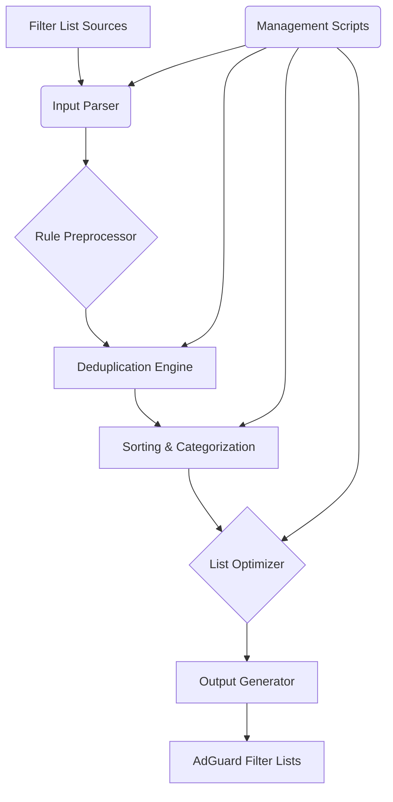

# AdGuard-FilterList-Manager-Python-Lib: The Ultimate Ad Blocking Filter Management Suite

[](https://github.com/your_username/AdGuard-FilterList-Manager-Python-Lib/actions/workflows/ci.yml)
[](https://codecov.io/gh/your_username/AdGuard-FilterList-Manager-Python-Lib)
[](https://pypi.org/project/AdGuard-FilterList-Manager-Python-Lib/)
[](https://creativecommons.org/licenses/by-nc/4.0/)
[](https://www.python.org/)

--- 

## ✨ **Project Overview**

The **AdGuard-FilterList-Manager-Python-Lib** is a sophisticated, Python-based library designed to automate the creation, curation, and dynamic management of AdGuard filter lists. It empowers users and developers to maintain optimal ad, tracker, and annoyance blocking configurations with unparalleled efficiency and precision, ensuring enhanced privacy and performance across a multitude of platforms.

--- 

## 🚀 **Key Features**

*   **Automated List Generation:** Scripted creation of new filter lists based on defined criteria.
*   **Dynamic Sorting & Merging:** Intelligent algorithms for sorting, deduplicating, and merging filter entries.
*   **Cross-Platform Compatibility:** Generates lists optimized for AdGuard Home, AdGuard Browser Extensions, and AdGuard for various operating systems.
*   **Advanced Curation:** Tools for classifying and tagging filter rules (e.g., Annoyances, Trackers, Social Widgets).
*   **Performance Optimization:** Techniques to minimize list size and parsing overhead.
*   **Extensible Architecture:** Modular design allowing for easy integration of new features and list sources.

--- 

## 📚 **Architecture**

This project adheres to a modular architecture, leveraging Python's standard library and best practices for maintainability and scalability. The core components are designed around the principles of the **Apex Tech Toolchain (Scenario C)**.



--- 

## 🛠️ **Getting Started**

### 1. Installation

This library can be installed using `uv`, the ultra-fast Python package installer.

```bash
curl -LsSf https://astral.sh/uv/install.sh | sh

# Or for global installation
# curl -LsSf https://astral.sh/uv/install.sh | sh -s -- --global

# Then install the library
uv pip install AdGuard-FilterList-Manager-Python-Lib
```

### 2. Basic Usage

```python
from adguard_filter_manager import FilterListManager

# Initialize the manager
manager = FilterListManager()

# Load rules from a file
manager.load_rules_from_file('my_custom_rules.txt')

# Add rules programmatically
manager.add_rule('||example.com^')
manager.add_rule('@@||example.com/tracker.js^$script')

# Sort and deduplicate the rules
manager.process_rules()

# Save the processed list
manager.save_to_file('processed_adguard_list.txt')

print("Filter list processed and saved successfully!")
```

### 3. Management Scripts

Run the provided Python scripts for advanced management tasks:

```bash
# Example: Generate a new list from multiple sources
python scripts/generate_list.py --sources source1.txt source2.txt --output combined_list.txt

# Example: Categorize rules in an existing list
python scripts/categorize_rules.py --input existing_list.txt --output categorized_list.txt
```

--- 

## 📈 **Development Workflow**

### 1. Setup

Clone the repository and set up the development environment using `uv`.

```bash
git clone https://github.com/your_username/AdGuard-FilterList-Manager-Python-Lib.git
cd AdGuard-FilterList-Manager-Python-Lib

uv venv  # Create a virtual environment
. .venv/bin/activate
uv pip install -r requirements-dev.txt
```

### 2. Running Linters & Formatters

This project uses **Ruff** for linting and formatting.

```bash
# Check for linting errors and formatting issues
ruff check .

# Automatically fix linting errors and format code
ruff check --fix .
```

### 3. Running Tests

Tests are written using **Pytest**.

```bash
# Run all tests
pytest

# Generate a coverage report
pytest --cov=adguard_filter_manager
```

### 4. Building & Publishing

To build the package for distribution:

```bash
python -m build
```

For publishing to PyPI (requires `twine` and account setup):

```bash
twine upload dist/*
```

--- 

## 🤖 **AI Agent Directives**

<details>
<summary>AI Agent Configuration</summary>

This repository is managed using the **Apex Technical Authority** framework, adhering to **Late 2025 Standards**. The core technical stack is Python, managed by `uv`, linted and formatted by `Ruff`, and tested with `Pytest`.

**Key Principles:**
*   **SOLID:** Enforced across all modules.
*   **DRY:** Repetitive logic is automated.
*   **CQS:** Methods are strictly Commands or Queries.
*   **Zero Trust:** All external inputs and data are rigorously validated.
*   **Fail Fast:** Errors are thrown immediately upon detection.
*   **Green Software:** Emphasis on efficiency and minimal resource usage.

**Verification Commands:**
*   **Lint/Format:** `ruff check --fix .`
*   **Test:** `pytest`
*   **Coverage:** `pytest --cov=adguard_filter_manager`

**CI/CD Workflow:** Managed via `.github/workflows/ci.yml`.

**Project Type:** Python Library.

**AI Orchestration Model Preference (Fallback Cascade):**
1.  `gemini-3-pro-preview`
2.  `gemini-2.5-pro`
3.  `gemini-2.5-flash`
4.  `gemini-2.5-flash-lite-preview-09-2025`
5.  `gemini-2.0-flash`

</details>

--- 

## 📜 **License**

This project is licensed under the **Creative Commons Attribution-NonCommercial 4.0 International License (CC BY-NC 4.0)**. This means you are free to share and adapt the material for non-commercial purposes, provided you give appropriate credit, provide a link to the license, and indicate if changes were made.

[Learn More](https://creativecommons.org/licenses/by-nc/4.0/)

--- 

## 🙏 **Contributing**

We welcome contributions to improve the **AdGuard-FilterList-Manager-Python-Lib**! Please refer to our [CONTRIBUTING.md](.github/CONTRIBUTING.md) for detailed guidelines on how to submit bug reports, feature requests, and pull requests.

**Star ⭐ this Repo if you find it useful!**
